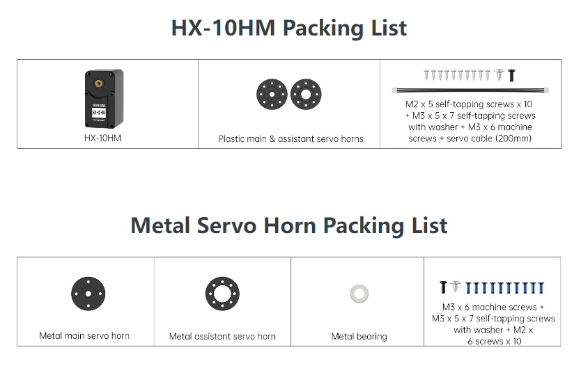

# 1. HX-10HM Bus Servo User Manual

## 1.1 Product Instruction

### 1.1.1 Introduction

HX-10HM magnetic encoder serial bus servo integrates servo drive, motor, and bus-servo signaling into a single unit controlled by UART serial commands at a baud rate of 115200. Based on the communication protocol provided, the servo can be commanded to move or to return status data. Three modes of operation are defined: Position mode, Velocity (Closed-Loop) mode, and PWM (Open-Loop) mode.

The servo features a half-duplex UART asynchronous serial interface and includes three ports per unit that allow servos to be daisy-chained together. In theory, up to 253 bus servos can be connected in series. This type of servo is widely used in robotics projects requiring closed-loop control, such as joint design in various biomimetic robots.

### 1.1.2 Working Principle

The internal components of a servo usually include the enclosure, the gear reduction system, the drive motor, the position-sensing potentiometer, and the control circuitry.

Bus servos communicate via an asynchronous serial bus, where the data lines are daisy-chained. The controller controls the servos by sending commands, and each serial transaction must be properly packaged and parsed according to the communication protocol.

The adopted data frame format typically includes a frame header, an ID, a length field, an instruction, parameters, and a checksum. The frame header marks the beginning of a new data transmission.

Within the frame format, the ID uniquely identifies each device. The length field specifies the number of data bytes, and the total packet length is obtained by adding three bytes to this value. The instruction field defines the control command, such as position or speed control, while the checksum verifies data integrity and guards against transmission errors.

During serial communication, the bus servo first sends a request packet with the appropriate parameters to the controller, such as position. The packet includes the target servo’s ID, and only the servo with a matching ID executes the command and returns its execution result and status information to the master. The master then parses the response and performs the corresponding actions.

It is precisely this feature that enables multiple bus servos to work together for synchronized control and data exchange, significantly enhancing system scalability and flexibility, and playing a crucial role in robotic components.

Regarding the bus servo communication protocol, please refer to [**Hiwonder Magnetic Encoder Bus Servo Communication Protocol Document\ 3 Servo Manual & Diagram**](https://drive.google.com/drive/folders/1yNuQURLEfLViTayNbIUnmOBkkj5wFe5O).

### 1.1.3 Servo Horn Installation & Pin Instruction

1. Refer to the image below for servo horn installation. Using the HX-10HM as an example, align the horn with the red cross direction shown when the servo is at its central position. If the horn cannot be installed in the cross orientation at neutral, see section [**1.4.3.2 Reading and Configuring Servo Information**](#anther1.4.3.2) and use the position calibration in the motion control position parameters to adjust the servo offset.

2. The port distribution and instruction refer to the following picture and table.

<table border="1">
  <thead>
    <tr>
      <th> Pin (from left to right)</th>
      <th>Instruction</th>
    </tr>
  </thead>
  <tbody>
    <tr>
      <td>GND</td>
      <td>Power ground</td>
    </tr>
    <tr>
      <td>VIN</td>
      <td>Power input</td>
    </tr>
    <tr>
      <td>SIG</td>
      <td>Signal terminal for half-duplex UART asynchronous serial interface</td>
    </tr>
  </tbody>
</table>

> [!NOTE]
>
> **When the servo and the microcontroller are not using the same power supply, ensure that the two power supplies share a common ground.**

### 1.1.4 Packing List

The servo and its accessories included in the shipment are shown in the image below:

## 1.2 Parameter

<table border="1">
  <tbody>
    <tr>
      <th>Product</th>
      <th>HX-10HM Magnetic Encoder Linear Bus Servo</th>
      <th>Control method</th>
      <th> UART serial command</th>
    </tr>
    <tr>
      <td>Brand</td>
      <td>Hiwonder</td>
      <td> Communication baud rate</td>
      <td>1000000</td>
    </tr>
    <tr>
      <td>Weight</td>
      <td>52g</td>
      <td> Memory</td>
      <td> Servo settings are automatically saved when power off</td>
    </tr>
    <tr>
      <td> Dimensions</td>
      <td>45.2x24.7x35mm</td>
      <td>Servo ID</td>
      <td> 0~253 for user setting, ID 1 is default</td>
    </tr>
    <tr>
      <td>Working voltage</td>
      <td>Rated 11.1 V, range 9–12.6 V</td>
      <td>Readback function</td>
      <td> Support angle readback</td>
    </tr>
    <tr>
      <td>Rotation speed</td>
        <td>0.10sec/60° 11.1V（HX-10HM）</td>
      <td>Protection</td>
      <td>Stall protection and over-temperature protection</td>
    </tr>
    <tr>
      <td>Servo torque</td>
      <td>
		10KG·cm 11.1V（HX-10HM）
      </td>
      <td>Parameter feedback</td>
      <td>Temperature, voltage and position</td>
    </tr>
    <tr>
	  <td>Rotation range</td>
      <td>0° ~ 360°</td>
      <td>Working mode</td>
      <td>Stall and overheat prevention</td>
    </tr>
    <tr>
      <td> No-load current</td>
      <td>100mA</td>
      <td>Gear type</td>
      <td>Metal gear</td>
    </tr>
    <tr>
      <td> Stall current</td>
      <td>3A</td>
      <td>Servo wire length</td>
      <td>20cm，optional wire lengths available</td>
    </tr>
    <tr>
      <td>Servo precision</td>
      <td>0.3°</td>
      <td>Connector number</td>
      <td>5264-3P</td>
    </tr>
    <tr>
      <td>Control angle range</td>
      <td>0~4095，corresponding to 0°~ 360°</td>
      <td>Application</td>
      <td> All kinds of bionic robot related joints</td>
    </tr>
  </tbody>	
</table>

## 1.3 Notice

Please carefully read the following precautions before operations:

1. The bus servo’s operating voltage is 9–12.6 V. Ensure the chosen power supply delivers a stable voltage within this range. Excessive voltage can damage the servo, while insufficient voltage may result in failed operation.

2. Factory default servo ID is 1. Ensure that the ID for each servo is preset to the required value before use.

3. To avoid multiple servos being set to the same ID, ensure each bus servo is connected alone when its ID is being programmed. Once IDs have been set, servos may be linked in a daisy chain. 

4. This bus servo is a high-precision product. Once powered, avoid forcibly rotating the servo horn by hand to prevent internal damage.

5. The bus servo tends to heat up during extended operation. Allow the servo to cool after a period of use to prevent overheating and avoid potential impacts on performance and service life.

6. Under continuous rotation, the load on the bus servo should not exceed its stall torque. It is recommended that the actual load be about 1/5 to 1/3 of the stall torque. 
   
   Stall torque is the maximum torque a servo can generate when its output is prevented from rotating. Because energy losses occur during operation, the applied load should remain within the rated limits. Excessive load forces the servo to work harder, increasing energy consumption and degrading performance.
   
7. Bus servo communication is susceptible to electromagnetic interference (EMI). To maintain reliable signal quality, avoid routing the bus servo close to high-power lines, motor wiring, or other potential interference sources.

8. To ensure safe operation, set the bus servo’s angle range and speed based on the requirements of  the specific project. Avoid operating beyond the mechanical constraints or at excessively high speeds to avoid collision or damage.

## 1.4 Servo Testing Operations

### 1.4.1 Magnetic Encoder Servo Debugging Board Introduction

The magnetic encoder servo debugging board is a tool for testing servos. Using the included PC software, ServoStudio, it can test servos and set their parameters. The debugging board can also communicate with a microcontroller via a serial interface to control the servos.

<table border="1">
  <thead>
    <tr>
      <th>Index Instruction</th>
      <th>Function Instruction</th>
    </tr>
  </thead>
  <tbody>
    <tr>
      <td>① 3pin Bus Servo Interface</td>
      <td>Connecting and debugging Bus Servo</td>
    </tr>
    <tr>
      <td>② Serial Port Pins</td>
      <td>It communicates with other MCUs via the serial port</td>
    </tr>
    <tr>
      <td>③ Type-c Interface</td>
      <td>It communicates with PC software/hardware Controller </td>
    </tr>
    <tr>
      <td>④ Power Terminal</td>
      <td>Lithium Battery Power Connection</td>
    </tr>
    <tr>
      <td>⑤ DC Interface</td>
      <td> Adapter Power Connection</td>
    </tr>
    <tr>
      <td>⑥ Communication Mode Select Pins</td>
      <td>Switch Communication Mode: USB/TTL</td>
    </tr>
  </tbody>
</table>

### 1.4.2 Hardware Connection

1. Insert the servo cable into the servo and then into the 5264-3-pin bus servo interface on the debug board.

2. Connect the red wire to the “+”, the black wire to “-”, then connect USB cable.

> [!NOTE]
>
> * **Avoid reversing the battery’s positive and negative connections.**
>* **Place the jumper cap on the Servo and USB pins.**

3. Connect the lithium battery to the docking cable. The cable features a reverse-polarity protection design. Do not force the connector if it does not fit.

   If a lithium battery is not available, please prepare a stable 12 V power supply.

### 1.4.3 PC Software Testing Description

**1.4.3.1 Servo Status Description**

The following three images illustrate the three basic servo positions: central position, maximum angle, and minimum angle. For visual reference, a servo disc is installed, with the label on the right-side used as the initial position reference.

 Central position (adjustable):  Servo angle 180°, corresponding position value 2047.

Maximum position per revolution: Servo angle 360°, corresponding position value 4095.

Minimum position per revolution: Servo angle 0°, corresponding position value 0.

**1.4.3.2 Reading and Configuring Servo Information**

1. Launch the servo debugging board software under [**2 Softwares \Servo Debugging Board Software**](https://drive.google.com/drive/folders/1ioQ2pQ2khwM2EKDpzUNFq_Fb1AMFJ6p0). On the left side of the interface, select the serial port, keep the default baud rate at 1000000, then click **Connect**.

2. After connecting via the serial port, click **Scan** in the Dashboard. The PC software then scans servo IDs 1–253 and displays the specific servos on the screen.

3. Click **Config** to enter the parameter settings interface, where the servo’s parameter information is displayed and can be adjusted as needed.

(1) Basic Configuration

① Basic Settings

In this section of the software, the servo ID can be set from 1 to 253, and one of eight available baud rates can be selected for servo communication with the PC software.

② Operating Mode

This panel allows selection of three modes: Position, Velocity (Closed-Loop), and PWM (Open-Loop).

In position mode, the servo operates in servo mode. In both Velocity (Closed-Loop) and PWM (Open-Loop) modes, the servo operates in Motor Mode.

③ Torque Control

This control mode is used to set the servo's minimum starting torque and maximum output torque limits. Set 1000 = 100% × Stall Torque.

> [!NOTE]
>
> **Setting the torque too low may prevent the servo from operating.**

(2)  Motion Control

① Position Control Parameters

* Position Calibration: Allows correction of the servo’s positional offset with a setting range from –2047 to 2047. If the servo horn cannot be aligned in the cross orientation during installation, modify this parameter to correct the deviation.
* Angle Limit (Minimum/Maximum):  Defines the allowed motion range for the servo. The valid range is –30719 to 30719. Since 0–4095 maps to 0–360°, this corresponds to about ±7.5 revolutions in absolute position mode. Configure the thresholds within this range as required.

② Position Closed-Loop Parameters

These three parameters are used to adjust the servo’s position error. The **P** parameter determines the influence of the current position error on the control output. The **I** parameter is used to eliminate long-term steady-state error and is typically left unchanged. The **D** parameter limits the rate of error variation, thereby improving overall system stability. These parameters can be adjusted according to requirements to achieve the desired performance.

③ Speed Closed-Loop Parameters

These two parameters are used to adjust the servo’s speed error, ensuring the servo moves at the specified velocity and maintains precise speed control. These parameters can be adjusted according to requirements to achieve the desired performance.

(3)  Safety Protection

The thresholds for each feature in the software, and the protection and alarm targets, can be configured according to specific requirements.

* The undervoltage and overvoltage thresholds range from 0 to 254, with each step corresponding to 0.1 V.

* The overcurrent threshold ranges from 0 to 6000 mA. And the overcurrent protection time threshold ranges from 0 to 254, with each unit corresponding to 10 ms.

* The overload threshold ranges from 0 to 100, with each unit representing 1 percent of the maximum torque. The overload time threshold ranges from 0 to 254, with each unit corresponding to 10 ms. The overload torque defines the maximum output torque after overload protection is triggered. It is adjustable from 0 to 100, with each unit representing 1 percent.

  The overtemperature protection threshold ranges from 0 to 100, with each unit corresponding to one degree Celsius.

**1.4.3.3 Servo Operation Control**

Click the **Monitor** option on the left to enter the servo debugging interface.

The interface includes five sections: ① Servo operation parameter waveform area. ② Command area for servo operation. ③ Auto Sweep area. ④ Step Mode area. ⑤ Feedback area.

The five areas are described as follows:

① Servo Operation Parameter Waveform Area:

This area displays the waveform graphs of six servo parameters during motion. Use the switches on the right to select which parameters to display, and use the controls below to set the time range shown.

② Servo Operation Area:

This area allows configuration of the three servo write modes: **Write**, **SyncWrite**, and **RegWrite**. Detailed information about these write modes can be found in the [Hiwonder Magnetic Encoder Bus Servo Communication Protocol Document](https://drive.google.com/drive/folders/1yNuQURLEfLViTayNbIUnmOBkkj5wFe5O). The **Torque** switch controls whether the servo is powered. When the switch is turned off, the servo stops outputting torque. If a servo horn is installed, it can then be manually rotated. **The slider** in the middle can be used to directly control the servo position, with a range of 0–4095. Below the slider, the following parameters can be set for servo movement:
**Accel** — acceleration, range 0–254, unit 100 steps/s².
**Speed** — speed, range 0–3400, unit steps/s.
**Target** — target position, range -30719 to 30719, unit steps.
**Time** — time, range 0–1000. At the bottom, three buttons are provided:
**As Center** sets the current target position as the central position. **Action** triggers motion in asynchronous write mode. **Apply** sends parameters to the servo in normal write and synchronous write modes.

> [!NOTE]
>
> * **Position mode: Time parameter has no effect**.
>* **Velocity (Closed-Loop) mode: only Speed parameter is used.**
> * **PWM (Open-Loop) mode: only Time parameter is used.**

③ Auto Sweep Area:

This section specifies the servo **Start** and **End** positions, which can be set within a range of −30719 to 30719 steps. **Delay** is the time gap between issuing the **Start** and **End** commands, and **Speed** is configured in the control area. After clicking **Start**, the servo repeatedly moves between the **Start** and **End** positions.

> [!NOTE]
>
> **If the delay time is shorter than the time required to move between the two positions, the current action will be interrupted.**

④ Auto Step Mode Area:

This section specifies the servo **Start** and **End** positions, which can be set within a range of −4095 to 4095 steps. **Step** ranges from 0 to 1000 steps, and **Delay** sets the time between step commands. When **Start** is clicked, the servo moves from the **Start** to **End** position according to the **Step** and **Delay**.

⑤ Feedback Area:

This section provides an intuitive view of the servo’s operating status and parameter values.